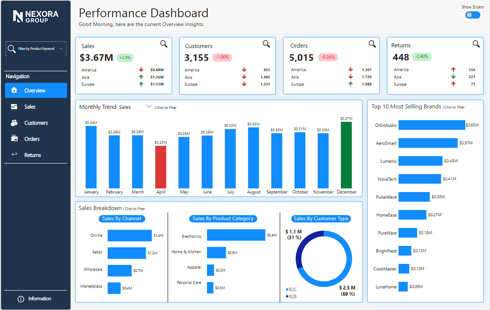
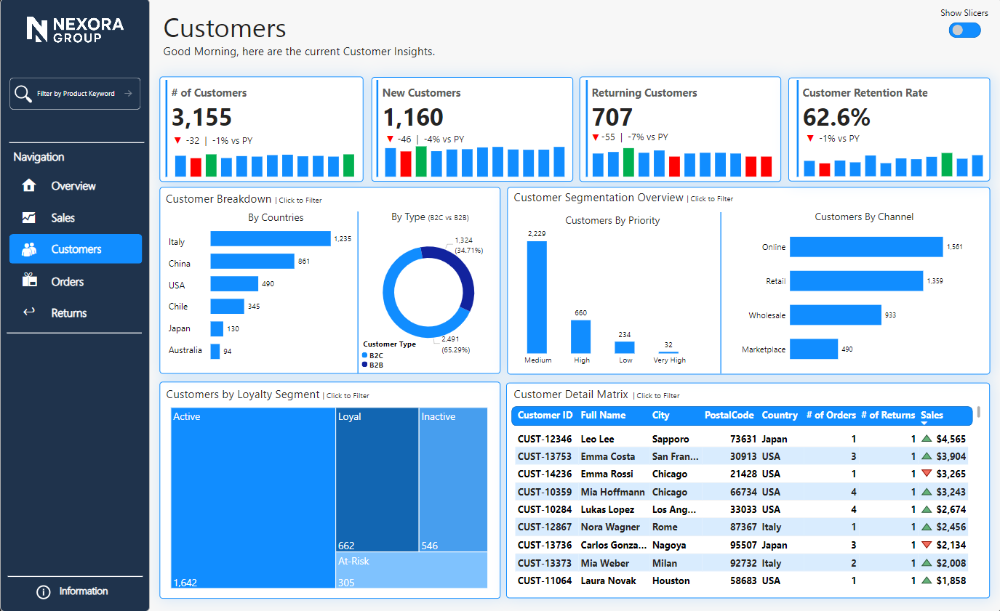
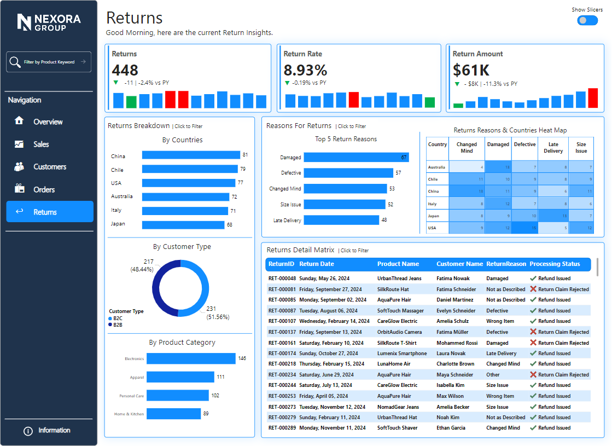

# Power BI Performance Dashboard

An interactive **end-to-end business performance dashboard** built in **Power BI**, designed to analyze **Sales, Customers, Orders, and Returns** across regions, channels, and time.

The dashboard focuses on **executive KPIs**, **operational insights**, and **driver analysis**, with an app-like user experience (focus mode, navigation, and slicer toggle).

---

## 🎯 Key Features

- Dynamic KPI cards with **Current Year vs Previous Year**
- **Focus Mode** for deep dives (trend analysis & key drivers)
- Centralized **slicer panel** with toggle control
- App-style **page navigation**
- Drill-down into **regions, countries, products, customers, and channels**
- Detailed **transaction-level matrices** for analysis

---

## 📊 Dashboard Pages Overview

### 1️⃣ Overview
High-level business snapshot with:
- Core KPIs: **Sales, Customers, Orders, Returns**
- Monthly performance trends
- Regional performance (America, Europe, Asia)
- Top brands, channels, categories, and customer types (B2B / B2C)

---

### 2️⃣ Sales Analysis
Sales performance and financial drivers:
- Net Sales, Quantity Sold, Avg Sales per Order
- Country-level sales & map view
- Top sub-categories and SKUs
- Financial summary: **Gross Sales, COGS, Gross Profit**
- Sales vs Profit correlation and monthly trends

---

### 3️⃣ Customers Analysis
Customer behavior and retention insights:
- Total, New, Returning Customers
- Customer Retention Rate
- Breakdown by country and customer type
- Customer segmentation (priority, channel, loyalty)
- Detailed customer matrix with sales & order metrics

---

### 4️⃣ Orders Analysis
Operational and order efficiency metrics:
- Total Orders, AOV, Completion & Cancellation Rates
- Orders by country, customer type, and status
- On-time delivery performance
- Order value segmentation & delivery time correlation

---

### 5️⃣ Returns Analysis
Return behavior and quality insights:
- Return volume, rate, and return sales value
- Breakdown by country, customer type, and category
- Reasons for returns (chart & heatmap)
- Detailed return-level matrix with processing status

---

## 🎥 Dashboard Walkthrough (Video)

A short walkthrough demonstrating navigation, interactions, focus mode, and insights:

📽️ **[Watch the dashboard walkthrough](video/dashboard_walkthrough.mp4)**

---

## 🛠 Tools & Technologies

- **Power BI**
- Power Query (data cleaning & transformation)
- DAX (KPIs, YoY comparisons, retention logic)
- Data modeling (star schema, relationships)

---

## 📁 Project File

- Power BI file: `Performance_Dashboard.pbix`

---

## 🚀 How to Use

1. Download the `.pbix` file  
2. Open in **Power BI Desktop**
3. Explore using slicers, navigation, and focus mode

---

## 📌 Notes

- Data is for demonstration purposes
- Dashboard design emphasizes **clarity, performance, and usability**
